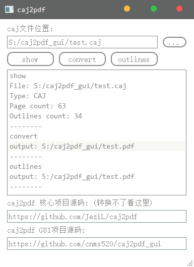

# caj2pdf_gui

A simple gui program for [caj2pdf project](https://github.com/JeziL/caj2pdf)

## Build platform

- Win7 x64
- Python 3.6.4 (AMD64)
- Pyinstaller 3.4

## Release

[OneDrive](https://1drv.ms/f/s!ApqgfoqX1ihmi2hH_3nCyS2lw9JC)

## License

本项目基于 [GLWTPL](https://github.com/me-shaon/GLWTPL)  (Good Luck With That Public License) 许可证开源。

