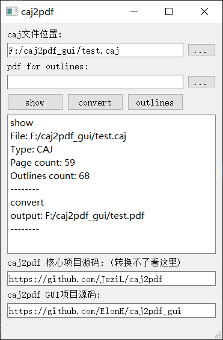
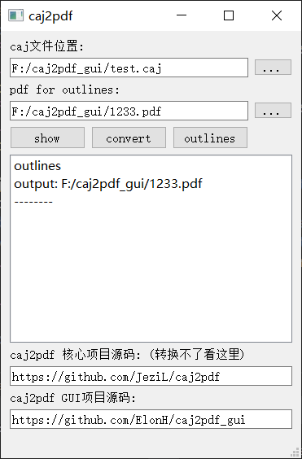

# caj2pdf_gui

A simple QT5 Application for [caj2pdf project](https://github.com/JeziL/caj2pdf)

为[caj2pdf 项目](https://github.com/JeziL/caj2pdf)制作了一个QT5图形界面

Adding CAJ file path and clicking 'convert' button translating CAJ to PDF file with outlines

1. Adding CAJ 
2. Adding correspondent PDF file without outlines
3. Finally, clicking 'outlines' button appending outlines to PDF extracted in CAJ file

## Build platform

- Win7 x64
- Python 3.7.2 (x86)
- Pyinstaller 3.4

## Release

[click here](https://github.com/ElonH/caj2pdf_gui/releases)

## License

本项目基于 [GLWTPL](https://github.com/me-shaon/GLWTPL)  (Good Luck With That Public License) 许可证开源。

